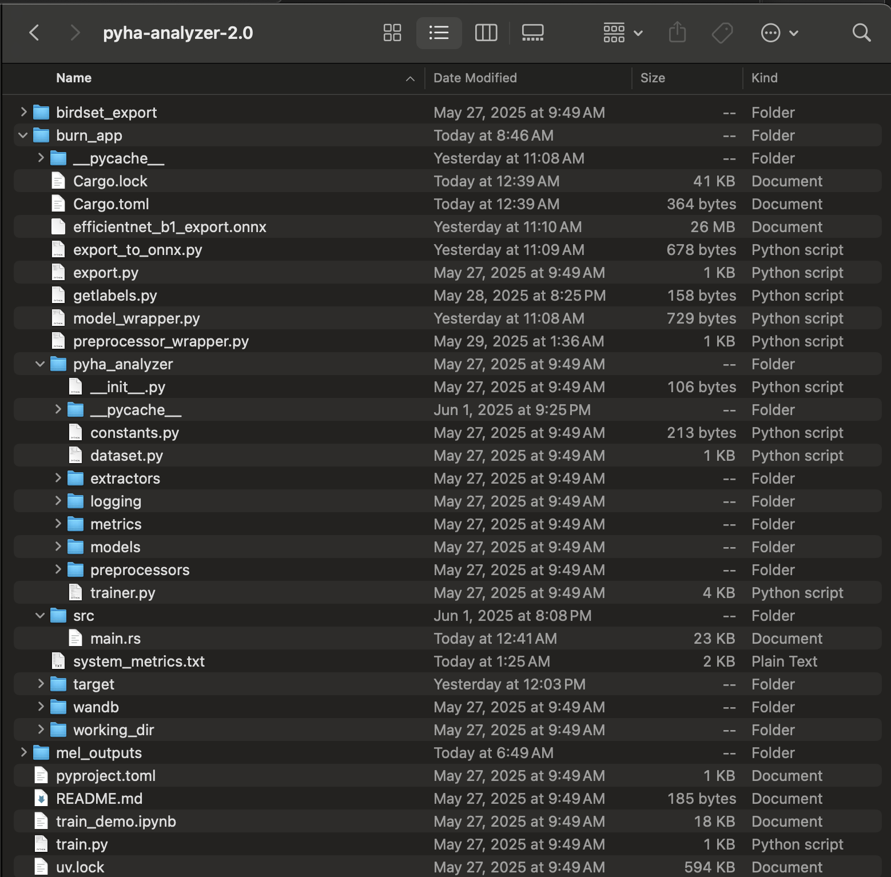
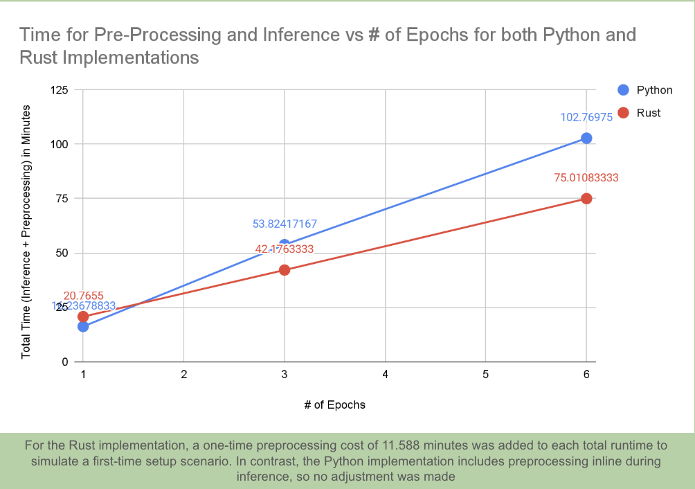

# Acoustic Species Inference Conversion
## by Siya Kamboj

### Abstract
To monitor biodiversity in a non-invasive way, researchers deploy acoustic loggers in natural habitats, generating terabytes of audio data. Manually labeling this much data is a major bottleneck for environmentalists’ ability to track biodiversity. A cross-platform desktop application, with efficient, on-device inference for species identification, can streamline this process. This paper focuses on converting Python-based inference pipelines into Rust, a programming language known for its performance and safety. By leveraging Burn and onnxruntime, we integrate machine learning inference directly into a Rust-based Electron app. This approach eliminates the need for a Python runtime or local web server, significantly improving performance, portability, and ease of deployment. We benchmarked the Rust-based inference against its Python counterpart and observed reduced time and comparable precision. These results demonstrate Rust’s viability for building high-performance, field-ready tools for scalable biodiversity monitoring.

### Important Links
- Midpoint Presentation: https://docs.google.com/presentation/d/14yESbDrgv_Fm4Z0y2W2DdVJx4XK_dFmQiILIhqsL5zo/edit?usp=sharing
- Final Presentation: https://docs.google.com/presentation/d/1KW4EVF14d5Ywq7Dlyfhr5BObpYU8zk9Tii_ZmJp0y0w/edit?usp=sharing

### Run the Code In This Repo (Rust Inference)
- cd pyha-analyzer-2.0
- source .venv/bin/activate
- export PYTHONPATH="/Users/siyakamboj/Downloads/acoustic-species-inference-conversion/pyha-analyzer-2.0/burn_app/pyha_analyzer:$PYTHONPATH"
- Run the following commands in the terminal. Do this for every new terminal session. 
    - export ORT_STRATEGY=system
    - export ORT_LIB_LOCATION=/opt/homebrew/lib
- cd burn_app
- cargo run
    - NOTE: All necessary wrappers/information is called through the main.rs file

### Run The Original Code (Python Inference)
NOTE: You must have access to kastner-ml, which is a remote server. Additionally, you must be able to git clone https://github.com/UCSD-E4E/pyha-analyzer-2.0 , which is a beta, minimized inference script with fewer bugs. 
- ssh kastner-ml
- cd pyha-analyzer-2.0
- source .venv/bin/activate (It should be noted that this is a uv virtual environment, not a pip virtual environment)
- Navigate to train_demo.ipynb 
- Set up your kernel:
    - cmd+shift+p to see vscode command pallete
    - Type and select "Python: Select Interpreter"
    - Paste location of your python within the uv venv. In my case, it was `/home/s.kamboj.400/pyha-analyzer-2.0/.venv/bin/python`

### Important Notes
It should be noted that since pyha_analayzer_2.0 is a clone of a private github repo, github prevents you from being able to see the file contents. Therefore, I placed a copy of the code I wrote in the folder "code_written" in the home directory. The main file to look at in this directory is called main.rs, while the other pieces of code are wrappers for importing different python modules, the model imported through onnx, etc. Even though this code cannot be run in a meaningful way from the home directory, it does document the work that was done. 

To understand the full file structure, please consult this image: 

### About This Project
#### Background
Acoustic species identification is a citizen science-based research project that uses machine learning to monitor the biodiversity of bird species. In this project, acoustic loggers are deployed in natural environments to record real-time bird audio data. This audio is then converted into spectrograms. Afterwards, we can then use computer vision algorithms to identify tracking and understanding biodiversity over time.

Currently, I have been working with other students to create a desktop app that enables our collaborators at the San Diego Zoo Wildlife Alliance to run our Python-based inference script on their local devices. However, the current script is slow, computationally inefficient, and requires connecting to a remote server. Therefore, this project focuses on converting the Python inference script into Rust—a high-performance, memory-safe programming language—to optimize the classification pipeline and make it easier to deploy without a web server. Once the standalone Rust implementation is complete, it will be integrated into the existing Electrondesktop application to contribute to the species identification workflow for our collaborators.

### Project Information
The inference workflow is 
Input : Audio File
1. Convert Audio File to Mel-Spectogram
2. Import the model via Onnxruntime
3. Feed the mel-spectogram as input to the model 
4. The model outputs a table where rows are audio files, columns are species names, and cells are probability that the species is present in the file
5. Save the species with the highest probability as the classification for each audio file
#### Pre-Processing
Python uses lazy transformations, so each audio file is tagged with the spectogram function, but it actually gets converted on-the-fly whenever needed. It is neither cached nor saved anywhere. By contrast, the Rust implementation imports the spectogram logic using a PY03 wrapper, saves the mel spectogram info as .npy files and uses that as an import to the inference.
##### Pros 
1. Overall faster - In python, preprocessing happens on the fly every time, but in rust, it is a long, ONE-TIME cost. 
##### Cons
1. Memory Overhead - Rust implementation requires more memory because spectogram information is saved. However, memory is not a bottleneck; rather, speed and deployability are prioirities, both of which are lacking in the Python inference script. Possible ideas for improvement are (a) cache-ing the npy files or (b) Quantizing the model, so the spectograms take up less space (ie no longer use floats)

#### Inference
Import the model, EfficentNet, using OnnxRuntime

#### Results

This shows that Rust is slower for the first epoch, because of the overhead of pre-processing. However, as shown in the photo below, it is significantly faster as the number of epochs increases. 

There are a couple reasons why Rust is faster: 
1. No interpreter overhead, which is native to Python
2. Precomputed mel spectrograms significantly cut down on pre-processing time
3. Onnx Runtime Optimizations

Additionally, there is a linear pattern for both implementations, showing that:
1. There is no caching in either implementation - each epoch runs independently and takes roughly the same amount of time.
2. Because of that, we can assume Rust will continue to scale better over more epochs or larger datasets.

